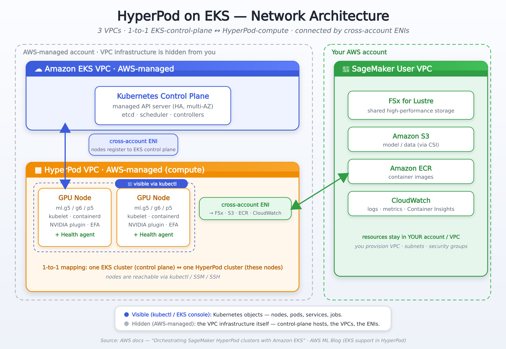

# Why SageMaker HyperPod on EKS?

> 이 문서는 **"왜 HyperPod EKS인가"** — 어떤 문제를 풀고, 일반 EKS와 무엇이 다르며, 언제 써야 하는지를 설명합니다.
> 실제 실행 방법은 [README.md](./README.md)를 참고하세요.

---

## 한 문장 요약

**SageMaker HyperPod EKS = 일반 Amazon EKS의 모든 유연성 + 대규모 ML에 필수인 "장애 자동 복구" 기능.**

익숙한 Kubernetes(kubectl, Helm, Operator)를 그대로 쓰면서, 수백~수천 개 GPU에서 며칠~몇 주씩 도는 학습이 **하드웨어 고장 때문에 멈추지 않도록** AWS가 인프라를 관리해 줍니다.

---

## 1. 풀려는 문제 — "대규모 학습에서 장애는 예외가 아니라 일상"

대규모 분산 학습의 불편한 진실: **GPU가 많아질수록, 학습이 길어질수록, 하드웨어 고장은 반드시 일어납니다.** 그리고 분산 학습은 GPU 하나만 죽어도 **전체 작업이 멈춥니다.**

> 📊 **실제 사례 — Meta Llama 3 405B**
> 16,000개 H100 GPU로 54일간 학습하는 동안 **419회의 예기치 못한 중단**이 발생했고, 그중 **78%가 하드웨어 문제**였습니다. ([Meta 논문](https://ai.meta.com/research/publications/the-llama-3-herd-of-models/))

일반 인프라에서 이런 중단이 나면 보통 이런 악순환이 반복됩니다:

```
GPU 한 개 고장  →  전체 학습 crash  →  엔지니어가 새벽에 호출됨
   →  죽은 노드 수동 교체  →  마지막 체크포인트 찾아 재시작  →  몇 시간/며칠 손실
```

**HyperPod는 이 과정을 사람 없이 자동화합니다.** 그게 핵심 가치입니다.

---

## 2. 핵심 가치 4가지

| | 가치 | 무엇을 의미하나 |
|---|---|---|
| 🛡️ | **복원력 (Resiliency)** | 고장을 미리 감지하고, 죽은 노드를 자동 교체하고, 체크포인트에서 자동 재개. 24시간 무중단 학습. |
| ⚙️ | **관리 부담 제거** | 클러스터 구축·패치·헬스 모니터링을 AWS가 담당. 엔지니어는 모델에만 집중. |
| 🔁 | **전체 라이프사이클 통합** | 학습 → 파인튜닝 → 추론을 **하나의 GPU 클러스터**에서. 리소스를 따로 둘 필요 없음. |
| 🧩 | **Kubernetes 네이티브** | kubectl·Helm·Operator 그대로. 기존 K8s 지식·생태계(Kubeflow, Kueue 등)를 100% 활용. |

> 💡 실제 효과: 한 고객(Observea)은 운영 비용을 **30% 이상 절감**했습니다.

---

## 3. 잠깐 — HyperPod는 "완전 관리형"이 아닙니다 (반관리형)

가장 흔한 오해: *"SageMaker니까 다 알아서 해주는 완전 관리형 아니야?"* → **아닙니다.**

"SageMaker AI"의 일반 학습 잡(training job)은 **완전 관리형**(잡을 던지면 AWS가 인스턴스를 띄우고 끝나면 없앰)이지만, **HyperPod는 반관리형(semi-managed)**입니다. **AWS는 인프라 복원력만 관리하고, 클러스터·소프트웨어·워크로드는 당신이 통제**합니다. 그래서 상시 떠 있는(persistent) 클러스터를 직접 운영하는 자유가 있습니다.

### 자기관리 EC2  ↔  HyperPod (반관리형)  ↔  SageMaker AI 학습 잡 (완전관리형)

| | 🔧 자기관리 EC2 GPU 클러스터 | ⭐ **SageMaker HyperPod** | ☁️ SageMaker AI Training Job |
|---|---|---|---|
| **관리 수준** | 직접 다 함 (unmanaged) | **반관리형 (semi-managed)** | 완전 관리형 (fully managed) |
| **클러스터 수명** | 상시 (직접 운영) | **상시 (persistent)** — 내가 소유·접속 | 잡마다 생성 후 소멸 |
| **노드 장애 복구** | **직접** 감지·교체 | **AWS가 자동** 감지·교체·재개 | AWS가 처리 (잡 단위) |
| **클러스터 SW / 환경** | 직접 (드라이버·K8s·런타임 전부) | **내가 통제** (kubectl·라이프사이클·컨테이너) | 안 보임 (AWS가 다 함) |
| **워크로드·스케줄링** | 직접 | **내가 통제** (Kueue·우선순위·잡 정의) | 잡 정의만 제출 |
| **노드 직접 접근** | ✅ SSH | ✅ kubectl / SSM / SSH | ❌ 불가 |
| **유연성 vs 단순함** | 유연하지만 운영부담 최대 | **유연 + 복원력 (균형점)** | 가장 단순하지만 통제권 최소 |

> **한 줄로**: HyperPod는 EC2의 *"내 맘대로 통제"*와 SageMaker AI의 *"AWS가 알아서"* 사이의 **중간 지점**입니다.
> **AWS가 떠맡는 건 "인프라가 고장 나도 안 멈추게 하는 것"뿐**이고, 그 위에서 무엇을 어떻게 돌릴지는 전부 당신 몫입니다.
>
> *출처: [SageMaker HyperPod 공식 문서](https://docs.aws.amazon.com/sagemaker/latest/dg/sagemaker-hyperpod.html) — "removing undifferentiated heavy-lifting … so that you can focus on running ML workloads"*

---

## 4. 일반 EKS vs HyperPod EKS — 핵심 차이

HyperPod EKS는 **일반 EKS를 대체하는 게 아니라, 그 위에 ML 복원력 계층을 얹은 것**입니다. 한눈 비교:

| 항목 | Amazon EKS | SageMaker HyperPod EKS |
|---|---|---|
| **목적** | 범용 컨테이너 (웹앱, 마이크로서비스, …) | 대규모 GPU/Trainium ML 워크로드 특화 |
| **장애 복구** | 표준 K8s self-healing (Pod 재시작 수준) | **Deep Health Check + 자동 노드 교체 + Job Auto-Resume** |
| **노드 관리** | 사용자가 노드그룹 직접 운영 | SageMaker API/콘솔로 관리, 라이프사이클 스크립트 자동 실행 |
| **헬스 체크** | 기본 liveness/readiness | GPU·Trainium·EFA에 대한 **심층 스트레스 테스트** |
| **ML 도구** | 직접 설치·구성 | Training Operator·분산학습 라이브러리·Kueue·MLflow 사전 통합 |
| **관찰성** | CloudWatch 기본 메트릭 | GPU·Trainium·EFA·파일시스템까지 **컨테이너 수준 상세 메트릭** |
| **네트워크 구조** | EKS 컨트롤 플레인(AWS 관리형) + 워커는 내 VPC | **3개 VPC**: EKS 컨트롤 플레인 + HyperPod 컴퓨트(둘 다 AWS 관리형) + 내 VPC, **크로스계정 ENI**로 연결 (아래 §5.1) |

### 복원력 3대 기능 (HyperPod만의 차별점)

이게 일반 EKS와 가장 크게 다른 부분이고, HyperPod를 쓰는 가장 큰 이유입니다.

- **🩺 Deep Health Checks** — 문제 있는 GPU/Trainium/EFA를 학습 투입 *전에* 스트레스 테스트로 걸러냄. (고장난 GPU에 작업을 안 줌)
- **🔧 Automated Node Recovery** — 메모리 고갈·디스크 장애·GPU 이상·커널 데드락을 실시간 감시 → 문제 노드를 자동으로 교체/재부팅.
- **▶️ Job Auto-Resume** — Kubeflow Training Operator 통합으로, 장애 발생 시 **마지막 체크포인트에서 학습을 자동 재개**. 사람 개입 불필요.

---

## 5. 아키텍처 한눈에


핵심은 **하나의 EKS 클러스터 위에서 학습과 추론이 같은 GPU 풀을 공유**하고, 그 아래를 HyperPod의 관리·복원력 계층이 받친다는 점입니다. (구성 요소별 설명은 [README의 아키텍처 섹션](./README.md#️-아키텍처-개요) 참고)

### 5.1 네트워크 구조 — 3개 VPC와 크로스계정 ENI

이 부분은 자주 오해받는 지점이라 정확히 짚습니다. HyperPod EKS는 **3개의 VPC**로 구성되며, 그중 둘은 **AWS가 관리**하고 하나는 **고객 소유**입니다.



| VPC | 소유 | 담는 것 |
|---|---|---|
| **Amazon EKS VPC** | AWS 관리형 | Kubernetes **컨트롤 플레인** — 고가용성 관리형 API 서버, etcd, 스케줄러 |
| **HyperPod VPC** | AWS 관리형 | HyperPod **컴퓨트(워커 노드)** — GPU 노드, kubelet, 헬스 모니터링 에이전트 |
| **SageMaker User VPC** | **고객 소유** | FSx for Lustre, S3, ECR, CloudWatch 등 **내 계정 리소스** (VPC·서브넷·보안그룹은 내가 프로비저닝) |

**⚠️ "AWS 관리형"이 "안 보인다"는 뜻은 아닙니다 — 무엇이 보이고 안 보이는지 구분이 중요합니다:**

| | 보이나? | 무엇 |
|---|---|---|
| 👁 **보임** (`kubectl` / EKS 콘솔) | ✅ | **Kubernetes 객체** — 노드(`kubectl get nodes`), Pod, 서비스, 잡 등. 컴퓨트가 AWS 관리형 VPC에 있어도 **내 클러스터의 노드로 조회·조작 가능**. |
| 🔒 **안 보임** (AWS가 관리) | ❌ | **VPC 인프라 자체** — 컨트롤 플레인 호스트, 두 관리형 VPC, 크로스계정 ENI. 패치·복구는 AWS가 담당. |

즉 일반 EKS에서 워커 노드의 EC2 인스턴스를 콘솔에서 직접 보던 것과 달리, HyperPod는 **인프라(VPC·인스턴스)는 가려도 Kubernetes 레벨의 가시성·제어는 그대로** 줍니다.

**연결 방식 — 크로스계정 ENI (cross-account ENI):**

- **1:1 매핑**: 하나의 EKS 클러스터(컨트롤 플레인) ↔ 하나의 HyperPod 클러스터(워커 노드).
- 워커 노드는 **크로스계정 ENI를 통해 EKS 컨트롤 플레인에 등록·통신**합니다. (노드가 어느 컨트롤 플레인에 붙을지 연결)
- **같은 크로스계정 ENI**로 노드가 **내 계정의 FSx · S3 · ECR · CloudWatch**에도 접근합니다. 덕분에 컴퓨트는 AWS 관리형 VPC에 격리돼 있으면서도, 데이터·이미지·로그는 내 계정에 안전하게 남습니다.
- 노드 접근은 `kubectl` 또는 SSM/SSH로 가능합니다.

> 즉 "EKS 컨트롤 플레인만 AWS 관리형"인 일반 EKS와 달리, HyperPod EKS는 **컨트롤 플레인과 컴퓨트가 모두 AWS 관리형 VPC**에 있고, 내 VPC와는 크로스계정 ENI로 다리를 놓습니다.
>
> *출처: AWS 공식 문서 [Orchestrating SageMaker HyperPod clusters with Amazon EKS](https://docs.aws.amazon.com/sagemaker/latest/dg/sagemaker-hyperpod-eks.html) 및 [AWS ML Blog — EKS support in HyperPod](https://aws.amazon.com/blogs/machine-learning/introducing-amazon-eks-support-in-amazon-sagemaker-hyperpod/)*

---

## 6. 언제 HyperPod EKS를 쓰고, 언제 일반 EKS를 쓰나?

> ⚠️ **먼저 오해 정리**: "GPU 학습은 HyperPod EKS, 일반 워크로드는 EKS"가 **아닙니다.**
> **일반 EKS로도 대규모 GPU 학습·추론은 충분히 가능합니다** (실제로 많이 합니다).
> 진짜 갈림길은 *GPU를 쓰느냐*가 아니라 **"복원력과 운영을 누가 책임지느냐"** 입니다.

같은 GPU 학습이라도 두 환경의 차이는 이렇습니다:

| | Amazon EKS (GPU 포함) | SageMaker HyperPod EKS |
|---|---|---|
| GPU 학습/추론 | ✅ 가능 | ✅ 가능 |
| 노드 고장 감지·교체 | **직접** 구현/운영 | **자동** |
| 고장 후 학습 재개 | **직접** (수동 또는 자체 스크립트) | **자동** (체크포인트에서 Job Auto-Resume) |
| 불량 GPU 사전 선별 | 별도 구성 필요 | **Deep Health Check 내장** |
| ML 도구(Training Operator 등) | 직접 설치 | 사전 통합 |

→ 즉 **둘 다 GPU를 굴리지만, HyperPod EKS는 "장애 대응·운영"을 AWS가 대신 해줍니다.**

### ✅ HyperPod EKS가 빛나는 경우

- 수백~수천 GPU의 **Foundation Model 사전학습**, 며칠~몇 주짜리 **장기 학습** — 이 규모/시간에서는 하드웨어 장애가 **반드시** 누적되므로, 자동 복구의 가치가 매우 큼
- 하드웨어 장애가 곧 **비용·일정 손실**인 프로덕션 ML
- 인프라 운영 인력을 최소화하고 **모델 개발에 집중**하려는 팀
- 학습·추론을 한 클러스터에서 운영하며 **GPU 활용도를 극대화**
- 고성능 추론(KV Cache, Intelligent Routing 등)

### ↩️ 일반 EKS로 충분한 경우

- 웹앱·API·마이크로서비스 등 **GPU가 필요 없는** 일반 워크로드
- **짧은 GPU 작업** — 몇 분~몇 시간이라 중간에 노드가 고장 날 확률이 낮고, 실패하면 그냥 다시 돌리면 되는 경우
- 이미 **자체 복원력/운영 체계**를 갖췄거나, HyperPod의 관리 계층이 불필요한 경우

> **요약**: GPU 사용 여부가 기준이 아닙니다. **"학습이 길고 규모가 커서 장애가 치명적 → 자동 복구가 필요"** 해지는 순간이 HyperPod EKS가 빛나는 지점입니다. 짧고 다시 돌리기 쉬운 작업이라면 일반 EKS의 GPU 노드로도 충분합니다.

---

## 7. 누가 어떻게 쓰나 (역할별)

| 역할 | HyperPod EKS에서 얻는 것 |
|---|---|
| **플랫폼 관리자** | SageMaker API/콘솔로 노드 관리, 라이프사이클 스크립트로 의존성 자동 설치, 클러스터 운영 부담 ↓ |
| **데이터 과학자 / ML 엔지니어** | HyperPod CLI 또는 kubectl로 작업 제출, 장애 자동 복구 덕에 babysitting 불필요, Slurm ↔ EKS 전환 가능 |
| **팀 리드** | Task Governance(Kueue)로 팀별 GPU 할당·우선순위·유휴 리소스 공유 → 비용 최적화 |

---

## 참고 자료

- [Introducing Amazon EKS support in Amazon SageMaker HyperPod](https://aws.amazon.com/blogs/machine-learning/introducing-amazon-eks-support-in-amazon-sagemaker-hyperpod/)
- [SageMaker HyperPod 공식 문서](https://docs.aws.amazon.com/sagemaker/latest/dg/sagemaker-hyperpod.html)
- [The Llama 3 Herd of Models (Meta)](https://ai.meta.com/research/publications/the-llama-3-herd-of-models/)
- 실습 가이드: [README.md](./README.md) → setup · training · inference · task-governance
