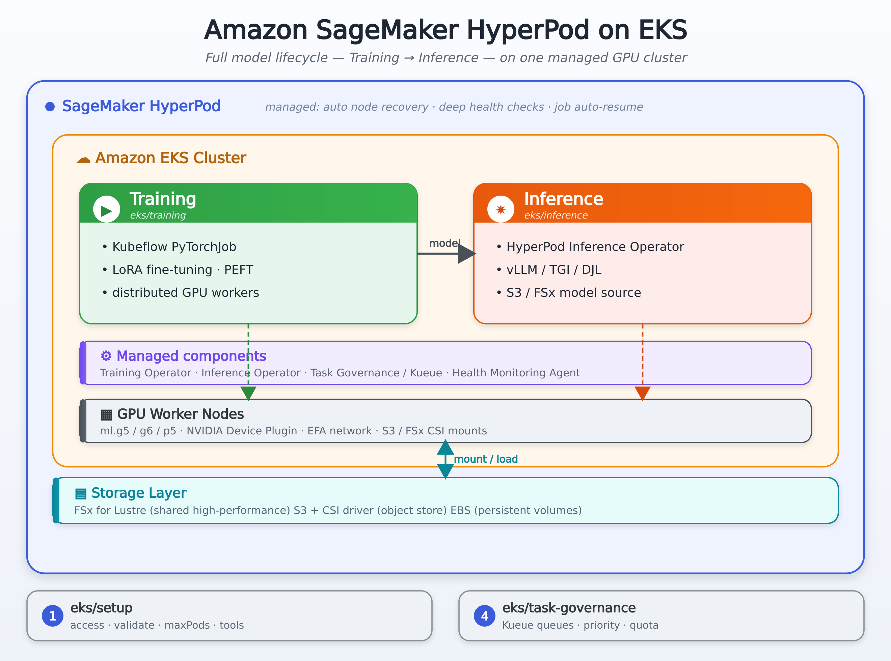

# Amazon SageMaker HyperPod on EKS — 핸즈온 가이드

EKS 기반 **Amazon SageMaker HyperPod** 클러스터에서 대규모 AI/ML 모델의 **학습(Training) → 추론(Inference) → 리소스 거버넌스(Task Governance)** 전 과정을 실습하는 가이드 모음입니다.

각 단계는 독립 폴더로 나뉘며, **필요한 부분만 골라** 진행할 수 있습니다. 모든 스크립트는 실제 HyperPod EKS 클러스터에서 실행·검증되었습니다.

<details>
<summary>📖 <b>처음이신가요? 기본 용어 먼저 보기 (클릭해서 펼치기)</b></summary>

<br>

| 용어 | 쉬운 설명 |
|---|---|
| **EKS** | AWS가 관리하는 **쿠버네티스** 클러스터. 컨테이너(앱)를 여러 서버에 띄우고 관리합니다. |
| **HyperPod** | SageMaker의 대규모 ML 인프라. 자동 장애 복구·헬스 체크를 갖춘 GPU 클러스터로, 여기서는 **EKS 기반**을 씁니다. |
| **노드(Node)** | 실제 작업이 도는 GPU 서버(EC2 인스턴스) 1대. 예: `ml.g5.2xlarge`. |
| **Pod** | 컨테이너를 실행하는 가장 작은 단위. "앱 1개 = Pod 1개". |
| **kubectl** | 쿠버네티스를 조작하는 명령줄 도구. |
| **Operator** | 특정 리소스(CRD)를 감시하다 자동으로 배포·관리해 주는 컨트롤러. (학습=Kubeflow Training Operator, 추론=HyperPod Inference Operator) |
| **PyTorchJob / InferenceEndpointConfig** | 각각 "분산 학습 정의서", "추론 엔드포인트 정의서" (쿠버네티스 CRD). YAML로 제출하면 operator가 처리합니다. |
| **Kueue / Task Governance** | 여러 팀·작업이 GPU를 나눠 쓰도록 **큐·우선순위·할당량**을 관리하는 시스템. |
| **FSx for Lustre / S3** | 모델·데이터를 두는 스토리지. FSx=고성능 공유 파일시스템, S3=오브젝트 스토리지. |

> 더 깊은 개념(HyperPod이 일반 EKS와 무엇이 다른지, 복원력 기능 등)은 [`FEATURES.md`](./FEATURES.md)를 참고하세요.

</details>

---

## 🗺️ 전체 구조

```
eks/
├── setup/             # ① 클러스터 접근·검증 (먼저 1회)
├── training/          # ② LoRA Fine-tuning (Kubeflow PyTorchJob)
├── inference/         # ③ 추론 엔드포인트 배포
│   ├── basic/         #    - 기본: FSx / S3 기반 배포 + 테스트
│   └── kvcache-and-intelligent-routing/   # - 고급: KV Cache·라우팅 벤치마크
├── task-governance/   # ④ 팀·작업 간 GPU 리소스 거버넌스 (Kueue)
└── FEATURES.md        # HyperPod EKS 개념·특징 설명
```

> **권장 순서**: `setup` → (`training` 또는 `inference`) → 필요 시 `task-governance`.
> setup을 제외한 나머지는 서로 독립적입니다.

---

## 🚀 빠른 시작

### ① Setup — 클러스터 접근 설정 (최초 1회) · [setup/README.md](./setup/README.md)

학습·추론에 앞서 **클러스터 정보 수집 → 접근 권한 → 검증**을 한 번 끝내 둡니다.

```bash
cd setup
./1.create-config-workshop.sh   # 클러스터 정보를 env_vars에 수집 (워크샵용)
                                # 일반 계정은 ./1.create-config.sh
./2.setup-eks-access.sh         # EKS 접근 권한 + kubectl/helm 설치
./3.validate-cluster.sh         # 노드·GPU·오퍼레이터·스토리지 점검
cd ..
```

> 작은 인스턴스(g5.2xlarge 등)에서 Pod 슬롯이 부족하면 `setup/4.ensure-workshop-capacity.sh`로 노드 `maxPods`를 올릴 수 있습니다. 각 스크립트 상세는 [setup/SCRIPTS.md](./setup/SCRIPTS.md) 참고.

### ② Training — LoRA Fine-tuning · [training/README.md](./training/README.md)

DeepSeek-R1-Distill-Qwen-1.5B를 **Kubeflow PyTorchJob**으로 분산 fine-tuning합니다.

```bash
cd training
./1.grant_eks_access.sh    # 클러스터 접근 (setup 했으면 빠르게 통과)
./2.run_training.sh        # PyTorchJob 배포 → worker Pod로 분산 학습
./3.monitor_training.sh    # 실시간 로그·상태 모니터링
./4.cleanup.sh             # 정리
```

### ③ Inference — 추론 엔드포인트 · [inference/README.md](./inference/README.md)

학습된 모델을 **HyperPod Inference Operator**(또는 표준 Deployment)로 서빙합니다.

```bash
cd inference/basic
./1.grant_eks_access.sh
# 배포 방식 선택 (FSx / S3-Operator / S3-Direct) — 상세는 basic/README.md
./2.prepare_fsx_inference.sh && kubectl apply -f deploy_fsx_lustre_inference_operator.yaml
```

- **기본 배포·테스트**: [inference/basic/README.md](./inference/basic/README.md)
- **고급(KV Cache·지능형 라우팅 벤치마크)**: [inference/kvcache-and-intelligent-routing/README.md](./inference/kvcache-and-intelligent-routing/README.md)

### ④ Task Governance — 리소스 거버넌스 · [task-governance/README.md](./task-governance/README.md)

여러 팀·작업이 GPU를 효율적으로 나눠 쓰도록 **Kueue 기반 큐·우선순위·할당량**을 설정합니다.

```bash
cd task-governance
./setup-task-governance.sh        # ClusterQueue·LocalQueue·우선순위 구성
# 큐가 막히면: ./fix-stuck-namespaces.sh
```

---

## 📂 각 영역 요약

| 영역 | 무엇을 하나 | 핵심 기술 | 상세 |
|---|---|---|---|
| **setup** | 클러스터 접근·권한·검증, 도구 자동 설치 | EKS Access Entry, kubectl/helm | [README](./setup/README.md) · [SCRIPTS](./setup/SCRIPTS.md) |
| **training** | LoRA fine-tuning (분산 학습) | Kubeflow Training Operator, PyTorchJob, PEFT | [README](./training/README.md) |
| **inference/basic** | 추론 엔드포인트 배포·테스트 | HyperPod Inference Operator, S3/FSx CSI, vLLM/TGI | [README](./inference/basic/README.md) |
| **inference/kvcache…** | 고급 추론 성능 벤치마크 | KV Cache, Intelligent Routing | [README](./inference/kvcache-and-intelligent-routing/README.md) |
| **task-governance** | 팀·작업 간 GPU 분배 | Kueue, ClusterQueue, 우선순위 | [README](./task-governance/README.md) |

---

## 🏗️ 아키텍처 개요



**워크플로우 요약**
- **학습**: `kubectl apply pytorchjob.yaml` → Training Operator가 worker Pod 분산 배치 → HuggingFace/FSx에서 데이터 로드 → LoRA 학습 → 결과 저장
- **추론**: `kubectl apply inferenceendpointconfig.yaml` → Inference Operator가 모델을 S3/FSx에서 로드 → vLLM/TGI 서버 + Service 생성 → 호출

---

## 💡 자주 만나는 문제 (공통)

이 핸즈온을 진행하며 실제로 자주 마주치는 이슈입니다. 상세 해결법은 각 폴더 README의 트러블슈팅 섹션에 있습니다.

| 증상 | 원인·해결 요약 |
|---|---|
| `Unauthorized` / `ExpiredToken` | 워크샵 임시 자격증명(STS) 만료 → 갱신 후 `grant_eks_access.sh` 재실행 |
| Pod가 계속 `Pending` | CPU/메모리 요청이 노드 **allocatable** 초과, 또는 GPU 부족 → 요청값/replicas 조정 |
| `CrashLoopBackOff` (학습) | 라이브러리 버전 충돌(`transformers`/`peft`) → 버전 핀 고정 ([training/README](./training/README.md)) |
| `conversion webhook ... no endpoints` | 추론 operator 애드온이 Kueue 의존 → Kueue 복구 후 애드온 재생성 ([inference/basic/README](./inference/basic/README.md)) |
| 노드 슬롯 부족(`Too many pods`) | `maxPods`가 낮음 → `setup/4.ensure-workshop-capacity.sh` |

---

## 📚 참고

- [`FEATURES.md`](./FEATURES.md) — HyperPod EKS란? EKS와의 차이, 복원력 기능 등 개념 설명
- [SageMaker HyperPod 공식 문서](https://docs.aws.amazon.com/sagemaker/latest/dg/sagemaker-hyperpod.html)
- [Kubeflow Training Operator](https://github.com/kubeflow/training-operator) · [PEFT](https://github.com/huggingface/peft) · [Kueue](https://kueue.sigs.k8s.io/)
