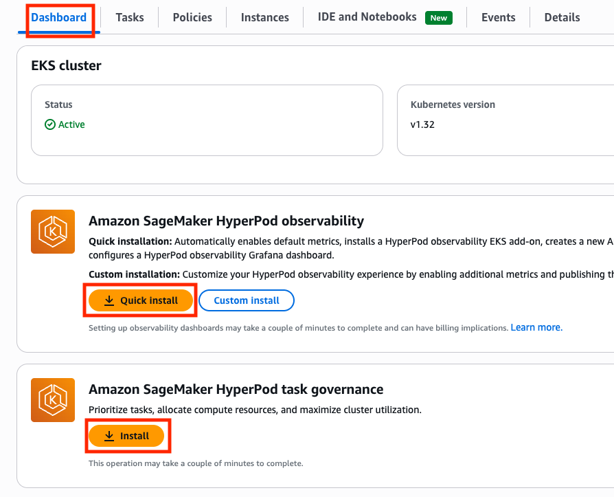
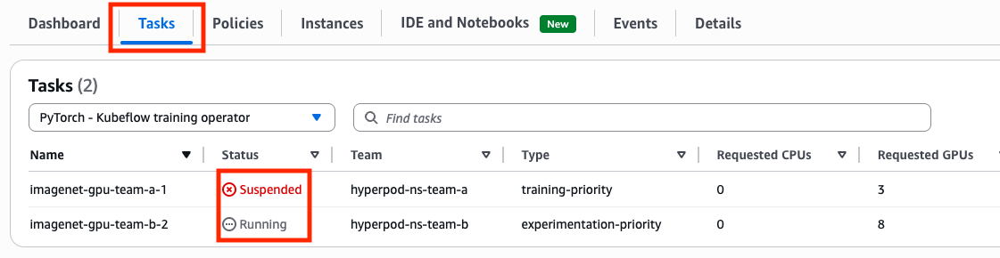

# SageMaker HyperPod Task Governance

SageMaker HyperPod Task governance는 Amazon EKS 클러스터에서 팀과 프로젝트 간의 리소스 할당을 간소화하고 컴퓨팅 리소스의 효율적인 활용을 보장하는 관리 시스템입니다. 관리자는 다양한 작업에 대한 우선순위 수준을 설정하고, 각 팀에 컴퓨팅 리소스를 할당하며, 팀 간에 유휴 컴퓨팅 리소스를 대여하고 차용하는 방법을 결정하고, 팀이 자체 작업을 선점할 수 있는지 구성할 수 있습니다.

## 주요 기능

### 리소스 할당 최적화
- **팀별 컴퓨팅 할당량**: 각 팀에 전용 GPU, CPU, 메모리 리소스를 할당
- **동적 리소스 공유**: 유휴 리소스를 다른 팀이 일시적으로 차용 가능
- **Fair-Share 가중치**: 팀 간 상대적 우선순위에 따른 리소스 분배

### 작업 우선순위 관리
- **우선순위 클래스**: inference, training, experimentation 등 작업 유형별 우선순위 설정
- **작업 선점**: 높은 우선순위 작업이 낮은 우선순위 작업을 선점 가능
- **큐 관리**: 작업 대기열을 우선순위에 따라 자동 관리

### 정책 기반 거버넌스
- **클러스터 정책**: 전체 클러스터의 리소스 할당 및 우선순위 정책 정의
- **컴퓨팅 할당**: 팀별 리소스 할당량 및 공유 전략 설정
- **선점 정책**: 팀 내부 또는 팀 간 작업 선점 규칙 구성

## 기술적 구현

HyperPod Task governance는 Kubernetes 네이티브 작업 큐잉, 스케줄링 및 할당량 관리를 위해 **Kueue**를 활용하며, HyperPod Task governance EKS 애드온을 사용하여 설치됩니다. 

### 관리되는 Kubernetes 리소스
설치되면 HyperPod는 다음과 같은 SageMaker AI 관리 Kubernetes 리소스를 생성하고 수정합니다:
- **KueueManagerConfig**: Kueue 전체 설정 관리
- **ClusterQueues**: 클러스터 레벨의 리소스 큐 관리
- **LocalQueues**: 네임스페이스별 로컬 큐 관리
- **WorkloadPriorityClasses**: 작업 우선순위 클래스 정의
- **ResourceFlavors**: 리소스 유형 및 특성 정의
- **ValidatingAdmissionPolicies**: 작업 제출 시 검증 정책

## 비즈니스 가치

### 비용 최적화
- **리소스 활용률 향상**: 유휴 리소스의 동적 재할당으로 최대 40% 비용 절감
- **오버프로비저닝 방지**: 팀별 실제 사용량에 기반한 효율적 리소스 계획

### 운영 효율성
- **자동화된 리소스 관리**: 수동 조정 없이 자동으로 리소스 할당 및 우선순위 적용
- **투명한 리소스 사용**: 팀별 리소스 사용량 및 대기 시간 가시성 제공

### 개발 생산성
- **빠른 실험 반복**: 높은 우선순위 작업의 즉시 실행으로 개발 속도 향상
- **공정한 리소스 접근**: Fair-Share 정책으로 모든 팀의 공평한 리소스 사용 보장

## Task Governance 핵심 개념

### 클러스터 정책 (Cluster Policy)

클러스터 정책은 유휴 컴퓨팅 리소스가 어떻게 차용되고 작업이 팀 간에 어떻게 우선순위가 매겨지는지를 결정합니다. 클러스터 정책은 두 가지 핵심 구성 요소로 구성됩니다:

#### 1. 유휴 컴퓨팅 할당 (Idle Compute Allocation)
유휴 컴퓨팅 할당은 팀 간에 유휴 컴퓨팅이 어떻게 분배되는지를 정의합니다:

- **First-come first-serve**: 팀 간 우선순위가 없으며, 각 작업은 할당량 초과 리소스를 얻을 동등한 기회를 가집니다
- **Fair-share**: 팀은 할당된 **Fair-share 가중치**에 따라 유휴 컴퓨팅을 차용합니다. 이 가중치는 컴퓨팅 할당에서 정의되며, 유휴 리소스가 사용 가능할 때 팀 간 컴퓨팅 분배 방식을 결정합니다

#### 2. 작업 우선순위 (Task Prioritization)
작업 우선순위는 컴퓨팅이 사용 가능해질 때 작업이 어떻게 대기열에 배치되는지를 결정합니다:

- **First-come first-serve**: 작업이 제출된 순서대로 대기열에 배치됩니다
- **Task ranking**: 작업이 할당된 우선순위에 따라 대기열에 배치됩니다. 동일한 우선순위 클래스 내의 작업은 선착순으로 처리됩니다

### 컴퓨팅 할당 (Compute Allocations)

컴퓨팅 할당 또는 컴퓨팅 할당량은 팀의 컴퓨팅 할당과 Fair-share 유휴 컴퓨팅 할당을 위해 팀에게 주어지는 가중치(또는 우선순위 수준)를 정의합니다. 

#### 주요 구성 요소:
- **리소스 할당량**: 팀별 보장된 컴퓨팅 리소스 (GPU, CPU, 메모리)
- **리소스 공유 전략**: 
  - `LendAndBorrow`: 유휴 리소스를 다른 팀에 대여하고 필요시 차용
  - `Lend`: 유휴 리소스를 다른 팀에만 대여
  - `Borrow`: 다른 팀의 유휴 리소스만 차용
  - `DontLend`: 리소스를 공유하지 않음
- **차용 한도**: 팀이 차용할 수 있는 최대 리소스 비율
- **선점 정책**: 팀 내 작업 간 선점 규칙 (`LowerPriority`, `Never`)

#### 할당량 관리 원칙:
- 전체 예약 할당량은 해당 리소스에 대한 클러스터의 사용 가능한 용량을 초과하지 않아야 합니다
- 예: 클러스터가 20개의 ml.c5.2xlarge 인스턴스로 구성된 경우, 팀에 할당된 누적 할당량은 20개 미만이어야 합니다

## Task Governance 활성화

### 사전 요구사항
- SageMaker HyperPod EKS cluster
- EKS 접근 권한 및 환경 변수: `../setup/README.md` 참조
- 기존 Kueue 설치가 없어야 함 (Task Governance 애드온 설치 전에 제거 필요)

### 설치 단계

#### AWS 콘솔
[SageMaker HyperPod 콘솔](https://us-west-2.console.aws.amazon.com/sagemaker/home#/cluster-management) 에서 클러스터를 선택하고 "Dasoboard" 탭에서 Amazon SageMaker HyperPod task governance 항목의 **Quick install** 버튼을 클릭하면 애드온을 활성화할 수 있습니다.



#### AWS CLI

**SageMaker HyperPod task governance EKS 애드온**을 설치하려면 다음 명령을 실행해주세요:

```bash
aws eks create-addon --region $AWS_REGION --cluster-name $EKS_CLUSTER_NAME --addon-name amazon-sagemaker-hyperpod-taskgovernance
```

설치 성공 여부를 확인하려면:

```bash
aws eks describe-addon --region $AWS_REGION --cluster-name $EKS_CLUSTER_NAME --addon-name amazon-sagemaker-hyperpod-taskgovernance
```

설치가 성공했다면 출력에서 설치된 애드온의 세부 정보를 확인할 수 있습니다.


## 예제 실행을 위한 설정 

### 개요 

예제를 실행하기 전에 클러스터 정책을 설정하고 팀별 컴퓨팅 할당을 정의해야 합니다.

이 예제는 Workshop Studio 실습을 위해 두 가지 인스턴스 타입 옵션을 지원합니다. 실제 여러분의 워크로드 적용 시에는 본 예제의 코드 스니펫과 가이드를 참고하여 코드를 수정해 주세요.

#### 옵션 1: 2 x `ml.g5.8xlarge` 인스턴스 (총 2 GPU)
- **Team A**: 1 GPU 할당 (ml.g5.8xlarge x 1개)
- **Team B**: 1 GPU 할당 (ml.g5.8xlarge x 2개)
- **리소스 공유**: 각 팀이 상대방의 유휴 리소스를 차용 가능

#### 옵션 2: 2 x `ml.g5.12xlarge` 인스턴스 (총 8 GPU)
- **Team A**: 2 GPU 할당 (ml.g5.12xlarge에서 Accelerators=2: 2 GPU)
- **Team B**: 8 GPU 할당 (ml.g5.12xlarge x 2개)
- **리소스 공유**: 각 팀이 상대방의 유휴 리소스를 차용 가능

두 팀 모두:
- **Fair-share 가중치**: 100 (동등한 우선순위)
- **차용 한도**: 100% (자신의 할당량만큼 추가 차용 가능)
- **선점 정책**: LowerPriority (낮은 우선순위 작업 선점 가능)

클러스터 정책은 기본 FIFO(First-In-First-Out) 동작 대신 작업 순위를 사용하여 높은 우선순위의 작업이 낮은 우선순위 작업을 선점할 수 있도록 합니다.

## 클러스터 정책 및 컴퓨팅 할당 설정

### 자동 설정 (권장)

```bash
./setup-task-governance.sh
```

스크립트 실행 시:
1. HyperPod 클러스터를 자동으로 감지하거나 선택할 수 있습니다.
2. 인스턴스 타입을 선택합니다 (`ml.g5.8xlarge` 또는 `ml.g5.12xlarge`)
3. 클러스터 정책과 두 팀의 컴퓨팅 할당을 자동으로 생성합니다.

**참고**: 기존 설정이 있는 경우 삭제하지 않고 그대로 유지됩니다.

### 수동 설정

수동으로 설정하려면 다음 단계를 따르세요:

#### 1. 클러스터 정책 생성

작업 우선순위 지정 방식과 유휴 컴퓨팅 할당 방식을 업데이트하려면 다음 구성을 사용하여 클러스터 정책을 적용해 주세요.

```bash
aws sagemaker \
    --region $AWS_REGION \
    create-cluster-scheduler-config \
    --name "example-cluster-scheduler-config" \
    --cluster-arn "<HyperPod ClusterArn 입력>" \
    --scheduler-config "PriorityClasses=[{Name=inference,Weight=90},{Name=experimentation,Weight=80},{Name=fine-tuning,Weight=50},{Name=training,Weight=70}],FairShare=Enabled"
```

#### 2. 컴퓨팅 할당 생성

**ml.g5.8xlarge 환경의 경우:**

**Team A 할당량 할당** (`ml.g5.8xlarge` x 1개 = 1 GPU. 인스턴스별이 아니라 GPU 단위로도 쪼갤 수 있음. 마찬가지로 vCPU, vCPU memory 단위로도 쪼갤 수 있음)


```bash
aws sagemaker \
    --region $AWS_REGION \
    create-compute-quota \
    --name "Team-A-Quota-Allocation" \
    --cluster-arn "<HyperPod ClusterArn 입력>" \
    --compute-quota-config "ComputeQuotaResources=[{InstanceType=ml.g5.8xlarge,Count=1}],ResourceSharingConfig={Strategy=LendAndBorrow,BorrowLimit=100},PreemptTeamTasks=LowerPriority" \
    --activation-state "Enabled" \
    --compute-quota-target "TeamName=team-a,FairShareWeight=100"
```

**Team B 할당량 할당** (`ml.g5.8xlarge` x 2개 = 2 GPU)
```bash
aws sagemaker \
    --region $AWS_REGION \
    create-compute-quota \
    --name "Team-B-Quota-Allocation" \
    --cluster-arn "<HyperPod ClusterArn 입력>" \
    --compute-quota-config "ComputeQuotaResources=[{InstanceType=ml.g5.8xlarge,Count=2}],ResourceSharingConfig={Strategy=LendAndBorrow,BorrowLimit=100},PreemptTeamTasks=LowerPriority" \
    --activation-state "Enabled" \
    --compute-quota-target "TeamName=team-b,FairShareWeight=100"
```

**ml.g5.12xlarge 환경의 경우:**

**Team A 할당량 할당** (`ml.g5.12xlarge`에서 2GPU만 할당. 인스턴스별이 아니라 GPU 단위로도 쪼갤 수 있음. 마찬가지로 vCPU, vCPU memory 단위로도 쪼갤 수 있음)


```bash
aws sagemaker \
    --region $AWS_REGION \
    create-compute-quota \
    --name "Team-A-Quota-Allocation" \
    --cluster-arn "<HyperPod ClusterArn 입력>" \
    --compute-quota-config "ComputeQuotaResources=[{InstanceType=ml.g5.12xlarge,Accelerators=2}],ResourceSharingConfig={Strategy=LendAndBorrow,BorrowLimit=100},PreemptTeamTasks=LowerPriority" \
    --activation-state "Enabled" \
    --compute-quota-target "TeamName=team-a,FairShareWeight=100"
```

**Team B 할당량 할당** (`ml.g5.12xlarge` x 2ea 할당 -> 8 GPUs)
```bash
aws sagemaker \
    --region $AWS_REGION \
    create-compute-quota \
    --name "Team-B-Quota-Allocation" \
    --cluster-arn "<HyperPod ClusterArn 입력>" \
    --compute-quota-config "ComputeQuotaResources=[{InstanceType=ml.g5.12xlarge,Count=2}],ResourceSharingConfig={Strategy=LendAndBorrow,BorrowLimit=100},PreemptTeamTasks=LowerPriority" \
    --activation-state "Enabled" \
    --compute-quota-target "TeamName=team-b,FairShareWeight=100"
```

다른 클러스터 크기를 사용하는 경우 CLI 명령과 작업 제출 구성을 그에 맞게 조정해주세요.

## 예제 실행

클러스터 정책과 컴퓨팅 할당이 구성되면, HyperPod task governance의 다양한 측면을 보여주는 다음 예제들을 실행할 수 있습니다:

`ml.g5.8xlarge`의 경우 아래 폴더로 이동합니다.
```bash
cd g5.8xlarge
```

`ml.g5.12xlarge`의 경우 아래 폴더로 이동합니다.
```bash
cd g5.12xlarge
```

### Job 1: 유휴 컴퓨팅 사용

**시나리오:** Team A가 **2장의 GPU**가 필요한 PyTorch 작업을 제출했지만 **1장의 GPU만 할당**되어 있어서 GPU가 부족합니다. 
다행히 Task Governance의 Policy에서 Team A가 Team B의 유휴 용량에서 1장의 GPU를 빌릴 수 있도록 허용되어 있기에, Team B에서 GPU를 당장 사용하지 않는다면 Team B의 GPU 1장을 빌려서 학습을 진행할 수 있습니다.

```bash
kubectl apply -f 1-imagenet-gpu-team-a.yaml --namespace hyperpod-ns-team-a
```

훈련 작업이 실행 중인지 확인해보세요 (컨테이너 이미지를 가져오는 데 시간이 걸릴 수 있습니다):
```bash
kubectl get pods -n hyperpod-ns-team-a
```

컨테이너 이미지를 가져온 이후 아래와 같은 메세지가 출력되어야 합니다.
```bash
NAME                             READY   STATUS    RESTARTS   AGE
etcd-gpu-548f58597c-kqr6k        1/1     Running   0          4s
imagenet-gpu-team-a-1-worker-0   1/1     Running   0          4s
imagenet-gpu-team-a-1-worker-1   1/1     Running   0          4s
```

파드가 실행되면 로그 출력을 확인하여 선출된 마스터를 식별할 수 있습니다:

```bash
kubectl logs imagenet-gpu-team-a-1-worker-0 --namespace hyperpod-ns-team-a | grep master_addr=
```
```
[2026-01-12 00:09:14,185] torch.distributed.elastic.agent.server.api: [INFO]   master_addr=imagenet-gpu-team-a-1-worker-0
```

그런 다음 `master_addr`에서 참조된 파드를 사용하여 현재 학습 진행 상황을 확인할 수 있습니다:
```bash
kubectl logs imagenet-gpu-team-a-1-worker-0 --namespace hyperpod-ns-team-a
```
분명 Team A는 할당된 GPU 리소스가 부족한데 학습이 잘 되고 있습니다:
```
...
Epoch: [0][ 400/1042]   Time  0.063 ( 0.068)    Data  0.041 ( 0.047)    Loss 5.1143e+00 (5.1643e+00)    Acc@1   3.12 (  2.51)   Acc@5  15.62 (  9.67)
Epoch: [0][ 400/1042]   Time  0.058 ( 0.068)    Data  0.041 ( 0.046)    Loss 4.9779e+00 (5.1654e+00)    Acc@1   0.00 (  2.71)   Acc@5   9.38 (  9.91)
Epoch: [0][ 410/1042]   Time  0.059 ( 0.068)    Data  0.041 ( 0.047)    Loss 4.6128e+00 (5.1670e+00)    Acc@1   0.00 (  2.54)   Acc@5   9.38 (  9.97)
Epoch: [0][ 410/1042]   Time  0.059 ( 0.068)    Data  0.041 ( 0.047)    Loss 4.8785e+00 (5.1590e+00)    Acc@1   3.12 (  2.54)   Acc@5  18.75 (  9.80)
Epoch: [0][ 410/1042]   Time  0.069 ( 0.068)    Data  0.051 ( 0.046)    Loss 5.3047e+00 (5.1587e+00)    Acc@1   0.00 (  2.74)   Acc@5   6.25 (  9.97)
...
```

### Job 2: 우선순위에 의한 선점

그런데 Team B가 Team B에 할당된 모든 GPU를 필요로 하는 **높은 우선순위 훈련 작업**을 제출합니다.  높은 우선순위 작업이 우선권을 가지므로, Team A의 훈련 작업이 일시 중단되고 Team B의 중요한 워크로드가 먼저 실행됩니다.


```bash
kubectl apply -f 2-imagenet-gpu-team-b-higher-prio.yaml --namespace hyperpod-ns-team-b
```

```bash
kubectl get pods -n hyperpod-ns-team-b
```

`Tasks` 탭을 클릭하면 `imagenet-gpu-team-a-1` 작업이 중단되고 (Suspended), `imagenet-gpu-team-b-2` 작업이 진행 중 (Running) 임을 알 수 있습니다.



AWS CLI로 로그를 확인해 보면 더 이상 Team A의 training Pod가 존재하지 않음을 알 수 있습니다.
```bash
kubectl logs imagenet-gpu-team-a-1-worker-0 --namespace hyperpod-ns-team-a
```
```
error: error from server (NotFound): pods "imagenet-gpu-team-a-1-worker-0" not found in namespace "hyperpod-ns-team-a"
```

아래 로그를 찍어보면 Team B에서 학습이 진행됨을 알 수 있습니다.
```bash
kubectl logs imagenet-gpu-team-b-2-worker-0 --namespace hyperpod-ns-team-b
```

```
...
Test: [ 40/313] Time  0.052 ( 0.053)    Loss 1.0461e+01 (1.0150e+01)    Acc@1   0.00 (  1.14)   Acc@5   3.12 (  2.29)
Test: [ 50/313] Time  0.052 ( 0.052)    Loss 1.0167e+01 (1.0153e+01)    Acc@1   0.00 (  1.16)   Acc@5   3.12 (  2.39)
Test: [ 50/313] Time  0.052 ( 0.052)    Loss 1.0167e+01 (1.0153e+01)    Acc@1   0.00 (  1.16)   Acc@5   3.12 (  2.39)
...
```

Team A의 중단된 학습을 재개하는 시나리오 재현을 위해 Team B의 학습을 강제로 중단해 봅시다.
```bash
kubectl delete -f 2-imagenet-gpu-team-b-higher-prio.yaml
```

이제 Team A가 다시 학습을 진행할 수 있으며, 콘솔 창에서 Team A의 학습 task가 **Running** 인 것을 확인할 수 있습니다. 다만 본 코드에서는 체크포인트 복구 로직을 구현하지 않았기에, 다시 처음부터 훈련을 진행하게 됩니다.


## Trouble
## 모범 사례

### 컴퓨팅 할당 관리

컴퓨팅 할당을 설정할 때 다음 사항을 고려해보세요:

- **팀의 작업 유형**: 이 팀이 일반적으로 실행하는 작업의 종류는 무엇인가요?
- **리소스 사용 패턴**: 이 팀이 지속적으로 작업을 실행하여 예약된 용량이 필요한가요?
- **상대적 우선순위**: 다른 팀과 비교하여 이 팀의 우선순위는 어떻게 되나요?

### Fair-Share 가중치 설정

Fair-share 가중치는 동일한 유휴 컴퓨팅을 놓고 경쟁할 때 다른 팀과 비교한 상대적 우선순위를 제공합니다. 높은 가중치를 가진 팀은 공유 용량 내에서 미사용 리소스에 더 빨리 접근할 수 있습니다.

### 리소스 공유 전략

요구사항에 따라 두 가지 할당량 공유 방식 중 선택해보세요:

1. **엄격한 리소스 제어**: 할당량 대여 및 차용을 비활성화하여 예약된 GPU 용량이 항상 워크로드에 사용 가능하도록 보장합니다.
2. **유연한 리소스 공유**: 필요할 때 다른 팀의 유휴 리소스를 활용하기 위해 할당량 차용을 활성화합니다.

## 추가 리소스

- [SageMaker HyperPod task governance 공식 문서](https://docs.aws.amazon.com/sagemaker/latest/dg/sagemaker-hyperpod-eks-operate-console-ui-governance.html)
- [Amazon EKS Support in Amazon SageMaker HyperPod 워크샵](https://catalog.us-east-1.prod.workshops.aws/workshops/2433d39e-ccfe-4c00-9d3d-9917b729258e/en-US)
- [Kueue 공식 문서](https://kueue.sigs.k8s.io/docs/)
- [AWS CLI 참조 - SageMaker](https://awscli.amazonaws.com/v2/documentation/api/latest/reference/sagemaker/)
